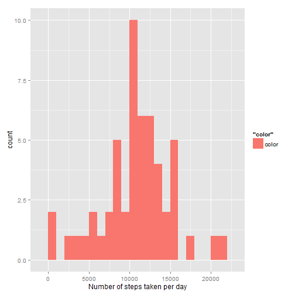
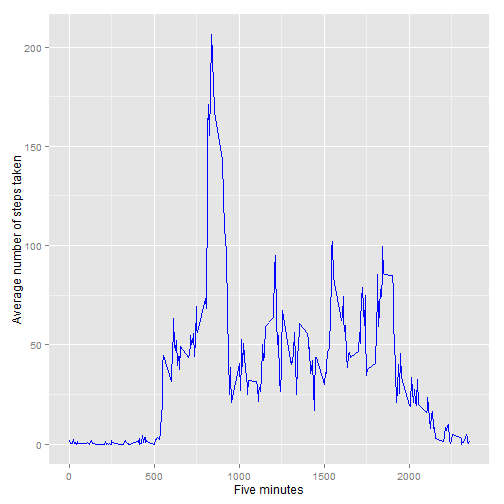
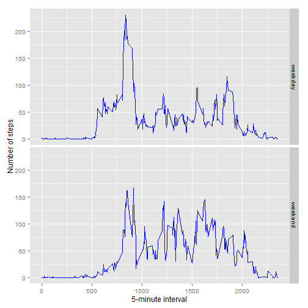

## 1: Unpack the data archive and load data from the activity csv file. 

```r
unzip( zipfile="activity.zip" )
rawData <- read.csv( "activity.csv" )
```

## 2: "What is mean total number of steps taken per day?"
We find the total number of steps (including n/a values) using Sum(), then plot the the outcome in a histogram using the ggplot library.

```r
library( ggplot2 )
totalStepsPerDay <- tapply( rawData$steps, rawData$date, FUN=sum, na.rm=FALSE )
qplot( totalStepsPerDay, binwidth=1000, geom="histogram", fill="color", xlab="Number of steps taken per day" )
```

 
  
Find the mean total steps per day.

```r
mean( totalStepsPerDay, na.rm=TRUE )
```

```
## [1] 10766.19
```
Find the median total steps per day.

```r
median( totalStepsPerDay, na.rm=TRUE )
```

```
## [1] 10765
```

## 3: "What is the average daily activity pattern?"
We find the average steps per 5 minute interval and plot the result using the ggplot library.

```r
library( ggplot2 )
averages <- aggregate( x=list( steps=rawData$steps ), 
                       by=list( interval=rawData$interval ), FUN=mean, na.rm=TRUE )

ggplot( data=averages, aes( x=interval, y=steps ) ) +
    geom_line( colour='blue' ) +
    xlab( "Five minutes" ) +
    ylab( "Average number of steps taken" )
```

 

"On average across all the days in the dataset, which 5 minute interval contains
the maximum number of steps?"  
We then use max() on our averages dataset.

```r
averages[ which.max(averages$steps), ]
```

```
##     interval    steps
## 104      835 206.1698
```

## 4: Imputing missing values

Note that there are a number of days/intervals where there are missing values (coded as NA). The presence of missing days may introduce bias into some calculations or summaries of the data.  
Missing days may adversly effect some calculations or summaries of the data and introduce bias to our outcome.


```r
missing <- is.na( rawData$steps )
# Create a table of how many are missing
table( missing )
```

```
## missing
## FALSE  TRUE 
## 15264  2304
```

We fill in all of the missing values with mean value for that 5-minute interval.


```r
# Replace each missing value with the mean value of its 5-minute interval
ReplaceMissingValue <- function(steps, interval) 
{
    filled <- NA
    if( !is.na( steps ) )
    {
        filled <- c( steps )
    }
    else
    {
        filled <- ( averages[averages$interval==interval, "steps"] )
    }
    
    return( filled )
}

filledData <- rawData
filledData$steps <- mapply( ReplaceMissingValue, filledData$steps, filledData$interval )
```
We use the filledData set and the ggplot2 library to creae a histogram of the steps taken per  
day and calculate the mean and median total number of steps.  


```r
totalStepsPerDay <- tapply( filledData$steps, filledData$date, FUN=sum )
qplot( totalStepsPerDay, binwidth=1000, xlab="number of steps taken per day" )
```

 

```r
mean( totalStepsPerDay )
```

```
## [1] 10766.19
```

```r
median( totalStepsPerDay )
```

```
## [1] 10766.19
```

As we would expect the mean and median values in the filledData are virtually identical to the original unfiltered data set.

## 5: Are there differences in activity patterns between weekdays and weekends?
We again use the filledData set and find the day of the week for each measurement in the set.  
Using the wekkdays() function we create our own function IsWeekday() that is passed to sapply with the data set.


```r
IsWeekday <- function( date ) 
{
      day <- weekdays( date )
      if( day %in% c( "Monday", "Tuesday", "Wednesday", "Thursday", "Friday" ) )
      {
            return( "weekday" )
      }
      else if( day %in% c( "Saturday", "Sunday" ) )
      {
            return( "weekend" )
      }
      else
      {
            stop( "invalid date" )
      }
}

filledData$date <- as.Date( filledData$date )
filledData$day <- sapply( filledData$date, FUN=IsWeekday )
```
Finally, we plot the data for steps taken on weekdays and weekends using ggplot.  
The plot reveals that while weekdays have a higher peak value of steps, weekends have a more balanced  
spread of higher step value data. 

```r
averages <- aggregate( steps ~ interval + day, data= filledData, mean )
ggplot( averages, aes( interval, steps )) + geom_line( colour='blue' ) + facet_grid( day ~ . ) +
    xlab( "5-minute interval" ) + ylab( "Number of steps" )
```

 
